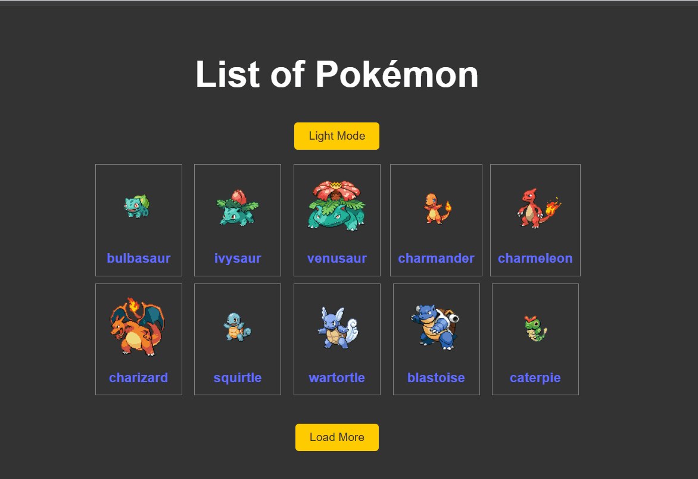

# Projeto Pokédex feito em React

Aplicativo feito com base na Quest de React Avançado do curso DevQuest DevEmDobro. Consumo de API com personagens Pokémon, link da API → https://pokeapi.co/ ←

## Funcionalidades do Projeto

- O Projeto apresenta 10 Pokémons em sua página inicial, ao clicar no botão "Load More", mais 10 Polémons são apresentados e assim por diante. 
- Nessa página inicial também temos o botão "Light Mode", pois o projeto se inicia em tema escuro. Ao clicar nesse botão, o app fica com tema claro, e o botão passa a chamar "Dark Mode", para que ele volte ao tema escuro.
- Cada Pokémon se apresenta como um card, e ao clicar nesse card, você tem os detalhes de cada, com seu nome, sua imagem, movimentos, habilidades, e com o texto descritivo de cada habiliudade, além do tipo do Pokémon, e um botão pra voltar à página principal.
- 10/03/2025 ACRESCENTADO O BOTÃO "Back to ten", que aparece depois que o botão "Load More" é clicado pela primeira vez, para que não seja necessário dar o F5 para que o sistema volte a ter só 10 Pokémons.
- 10/03/2025 Criado também os test cases para testar funcionalidades:
    - Alternância entre os modos claro e escuro;
    - Verificar se o botão "Load More" acrescenta mais dez Pokémons à lista inicial;
    - Verificar se ao clicar no Card do Pokémon, ele entra nos detalhes de cada Pokémon;
    - Verificar se ao clicar no botão "Back" nos detalhes dos Pokémons, volta para a página inicial;
    - Verificar o botão "Back to ten" que aparece só após ser clicado pela primeira vez o botão "Load More", para que a página inicial volte a ter apenas 10 Pokémons.
- 10/03/2025 - Corrigida a responsividade. Agora a apresentação dos cards dos Pokémons fica perfeita tanto em telas grandes, desktops 💻, quanto em telas mobile... 📱
- 🚥 Funcinalidades atualizadas 23/03/2025 
    - 1. Carrega a página → Busca os 10 primeiros Pokémons de qualquer tipo e renderiza na tela, com um botão "Load More", abaixo, um switcher para trocar de tema, claro e escuro, e um select que carrega os tipos de Pokémons; 
    - 2. Ao clicar no botão "Load More", dependendo do tipo de Pokémon escolhido no select, carrega mais 10 sempre seguindo o mesmo tipo escolhido no select, e a partir do primeiro clique nesse botão, o botão "Back to Ten" aparece, sendo responsável à voltar para os 10 primeiros, sempre respeitando o select do tipo escolhido, e o botão "Load More" vai carregando mais 10, sempre do tipo selecionado, a cada clique;
    - 3. No Select que é preenchido na renderização, você escolhe os tipos de Pokémons, um por vez, selecionando todos os Pokémons por tipo escolhido, ao clicar no botão "Load More", o carregamento de mais dez Pokémons tem que ser feito sempre respeitando o tipo escolhido;
    - 4. O Switcher vai ser responsável por trocar o tema, Dark e Light, aberto a novos temas no futuro, como o tema do Sistema Operacional em atual uso;
    - 5. Dentro dos cards carregados na tela, ao clicar em uma dessas telas, o card do Pokémon escolhido abre PokemonDetails.jsx, mostrando os detalhes desse Pokémon, e o detalhe agora está na próxima funcinalidade;
    - 6. Quando no PokemonDetails.jsx, ao clicar no botão "Back", a página Home.jsx deve voltar SEMPRE apresentando a mesma tela que existia quando o card foi clicado, ou seja, os mesmos Pokémons, por tipo, e a mesma quantia, 10 ou mais mostradas na tela inicial quando clicado o card; ESSA FUNCIONALIDADE NÃO ESTÁ CORRETA
    - 7. O botão "Back to ten" assim como o "Back" do PokemonDetails.jsx deve voltar aos 10 primeiros mas respeitando o select de tipo.

## Linguagens/Ferramentas utilizadas

- React + Vite              ➡ por seu desempenho e experiência. Compilação e refresh mais rápido.
- React-router-dom          ➡ Navegação interna fácil e em Single Page Application - SAP
- React styled-components   ➡ CSS segregando arquivos e facilitando o entendimento e a  manutenção.
- React-context             ➡ para utilização do toggler, mudança do tema claro e escuro.
- React Axios               ➡ Para busca e consumo da API. 

## Decisões tomadas durante o desenvolvimento, e o porquê de cada uma delas

1️⃣ Planejamento das pastas e arquivos e a disponibilidade de tais dentro do projeto; 
2️⃣ Criação da página de apresentação; 
3️⃣ Navegação interna entre as páginas; 
4️⃣ Criação dos exports de cada arquivo e import de tais, ligando todas as páginas, ou arquivos, dentro do projeto; 
5️⃣ Finalização dos arquivos e ligação entre eles, navegação entre a página principal e a página dos detalhes dos Pokémons; 
6️⃣ Criação e aplicação dos estilos; 
7️⃣ Refatoração para melhor compreensão e análise do código Home.jsx; 
8️⃣ Melhorias no select de Pokémon por tipo, com a imagem de cada tipo; 
9️⃣ Melhorias nos useEffects parar melhor re-renderização na troca de tipos de Pokémons, ao chamar mais 10 e ao voltar aos 10 iniciais;
🔟 Melhorias no useEffects e na busca por Pokemõns e Pokemóns por tipo para guardar a quantidade de Pokemóns no localStorage e mostrar a mesma quantia na re-renderização.

## Comandos para rodar o projeto em um computador local.

▫ Fazer o GitClone do repositório 
▫▫ git clone https://github.com/IsaiasLourenco/pokedex-api.git 
▫▫▫ Verifique se o Node.js está instalado 
▫▫▫▫ node -v 
▫▫▫▫▪ Instalar as dependências do projeto 
▫▫▫▫▫▫ npm install - React 
▫▫▫▫▫▫ npm install react-router-dom - React Router 
▫▫▫▫▫▫ npm install styled-components - Styled Components 
▫▫▫▫▫▫ npm run dev - Para iniciar o projeto

## Muito feliz em estar chegando ao final do Front End Developer

- Agradecimentos ao pessoal do DevEmDobro
- Agradecimentos ao Pablo Viana por ajudar a entender alguns problemas da versão 18 e 19 do React https://github.com/pablovianas

## Reposítório e Linkedin

✅ https://github.com/IsaiasLourenco 
✅ https://www.linkedin.com/in/isaias-lourenco/

